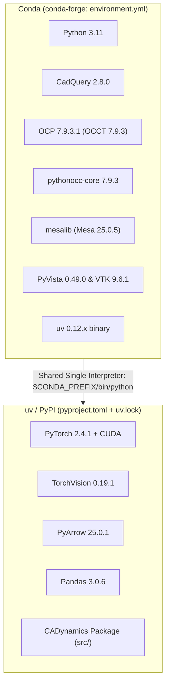

# CADynamics Environment & Reproducibility Guide

## 1. Architectural Philosophy: The Hybrid Dependency Strategy

CADynamics combines two distinct software ecosystems that have historically incompatible packaging mechanisms:

1. **Native CAD & B-Rep Geometry Stack**:
   - **OpenCASCADE Technology (OCCT)**: Heavy C++ computational geometry engine.
   - **OCP (OpenCASCADE Python)**: Python bindings built with pybind11 wrapping OCCT C++ classes.
   - **CadQuery**: High-level parametric CAD modeling framework.
   - **pythonocc-core**: Low-level OCC Python bindings used for topological research queries.
   - **Mesa / PyVista / VTK**: Off-screen software OpenGL rendering contexts for headless multi-view CAD image generation.
   - **Ownership**: **Conda** (`conda-forge`). Conda manages the compiled C++ shared libraries (`.so`), OpenGL contexts, and ABI compatibility across CadQuery, OCCT, and PyVista.

2. **Python Research & Machine Learning Stack**:
   - **PyTorch & CUDA Runtime**: Tensor operations, autograd, neural networks (`torch==2.4.1`, `torchvision==0.19.1`, `torchdata==0.7.1`).
   - **Graph Learning & Transformers**: Native PyTorch tensor architectures (`torch.index_add_`, Multihead Attention) with zero external C++ dependencies.
   - **Data Processing & Tabular Serialization**: PyArrow (`25.0.1`), Pandas (`3.0.6`), NumPy (`2.4.6`), Pydantic (`2.13.5`).
   - **Tooling & Test**: PyTest (`9.1.1`), Ruff, Black, TQDM, IPython/IPyKernel.
   - **CADynamics**: The core Python library (`cadynamics`).
   - **Ownership**: **uv** (via PyPI wheels). `uv` provides deterministic, high-speed resolution and wheel management.



> [!IMPORTANT]
> **Single Python Runtime Principle**: There is exactly **one** Python runtime for the project: the Conda environment interpreter located at `$CONDA_PREFIX/bin/python`.
> We do NOT create or nest a separate uv `.venv`. All Python packages are installed directly into the Conda environment using uv's `--python "$CONDA_PREFIX/bin/python"` or `--active --inexact` flags.

---

## 2. Package Ownership Matrix

| Stack Layer | Package | Version | Managed By | Specification Source |
| :--- | :--- | :--- | :--- | :--- |
| **Interpreter** | `python` | 3.11.16 | Conda (`conda-forge`) | [environment.yml](file:///home/onyxia/work/cadynamics/environment.yml) |
| **CAD Kernel** | `cadquery` | 2.8.0 | Conda (`conda-forge`) | [environment.yml](file:///home/onyxia/work/cadynamics/environment.yml) |
| **B-Rep Bindings** | `ocp` / `occt` | 7.9.3.1 / 7.9.3 | Conda (`conda-forge`) | Transitive via `cadquery` |
| **OCC Bindings** | `pythonocc-core` | 7.9.3 | Conda (`conda-forge`) | [environment.yml](file:///home/onyxia/work/cadynamics/environment.yml) |
| **Headless GL** | `mesalib` | 25.0.5 | Conda (`conda-forge`) | [environment.yml](file:///home/onyxia/work/cadynamics/environment.yml) |
| **3D Rendering** | `pyvista` / `vtk` | 0.49.0 / 9.6.1 | Conda (`conda-forge`) | [environment.yml](file:///home/onyxia/work/cadynamics/environment.yml) |
| **Package Tool**| `uv` | 0.12.21 | Conda (`conda-forge`) | [environment.yml](file:///home/onyxia/work/cadynamics/environment.yml) |
| **Deep Learning**| `torch` | 2.4.1 | uv (PyPI / PyTorch index) | [pyproject.toml](file:///home/onyxia/work/cadynamics/pyproject.toml), [uv.lock](file:///home/onyxia/work/cadynamics/uv.lock) |
| **Deep Learning**| `torchvision` | 0.19.1 | uv (PyPI / PyTorch index) | [pyproject.toml](file:///home/onyxia/work/cadynamics/pyproject.toml), [uv.lock](file:///home/onyxia/work/cadynamics/uv.lock) |
| **Deep Learning**| `torchdata` | 0.7.1 | uv (PyPI) | [pyproject.toml](file:///home/onyxia/work/cadynamics/pyproject.toml), [uv.lock](file:///home/onyxia/work/cadynamics/uv.lock) |
| **Data Format** | `pyarrow` | 25.0.1 | uv (PyPI) | [pyproject.toml](file:///home/onyxia/work/cadynamics/pyproject.toml), [uv.lock](file:///home/onyxia/work/cadynamics/uv.lock) |
| **Data Frames** | `pandas` | 3.0.6 | uv (PyPI) | [pyproject.toml](file:///home/onyxia/work/cadynamics/pyproject.toml), [uv.lock](file:///home/onyxia/work/cadynamics/uv.lock) |
| **Validation** | `pydantic` | 2.13.5 | uv (PyPI) | [pyproject.toml](file:///home/onyxia/work/cadynamics/pyproject.toml), [uv.lock](file:///home/onyxia/work/cadynamics/uv.lock) |
| **Testing** | `pytest` | 9.1.1 | uv (PyPI) | [pyproject.toml](file:///home/onyxia/work/cadynamics/pyproject.toml), [uv.lock](file:///home/onyxia/work/cadynamics/uv.lock) |
| **Core Project** | `cadynamics` | 0.3.0 | uv (local editable `-e .`) | [pyproject.toml](file:///home/onyxia/work/cadynamics/pyproject.toml) |

---

## 3. Preventing Conda and uv Conflicts

To prevent uv from colliding with Conda or creating unwanted isolated virtual environments:

1. **Target the Conda Interpreter Explicitly**:
   ```bash
   uv pip install --python "$CONDA_PREFIX/bin/python" -e .
   ```
2. **Prevent Accidental Pruning**:
   If running `uv sync`, ALWAYS provide `--active --inexact`:
   ```bash
   uv sync --active --inexact
   ```
   *Rationale*: By default, `uv sync` without `--inexact` will attempt to uninstall packages present in the environment that are not listed in `pyproject.toml`/`uv.lock`. Adding `--inexact` instructs `uv` to preserve foreign Conda-managed packages like `cadquery`, `ocp`, and `mesalib`.
3. **Interpreter Commands**:
   All CLI commands must run under the activated Conda environment:
   ```bash
   conda activate cadyn-env
   python -c "import cadquery, torch; print('OK')"
   pytest
   python scripts/verify_env.py
   ```

---

## 4. Environment Inventory & Snapshot Files

The repository maintains an exact diagnostic record of the verified working environment in [`env/`](file:///home/onyxia/work/cadynamics/env/):

```text
env/
├── conda-explicit.txt       # Exact OS/architecture build-hash Conda package dump (machine-specific)
├── conda-full.yml           # Complete Conda environment export with versions
├── conda-history.yml        # User-requested Conda specifications
├── python-freeze.txt        # Full uv/pip package freeze with versions
└── environment-report.txt   # Comprehensive hardware, OS, CUDA, and kernel diagnostic report
```

---

## 5. Operations & Workflows

### Bootstrap on a New Machine
To set up a fresh Linux machine:
```bash
./scripts/env/bootstrap.sh
```

### Verify Environment Health
To check CAD kernel functionality, module imports, and CUDA status:
```bash
conda activate cadyn-env
python scripts/env/verify.py
```

### Freeze an Updated Environment Snapshot
To update the diagnostic snapshot in `env/` without mutating dependencies:
```bash
conda activate cadyn-env
./scripts/env/freeze.sh
```
